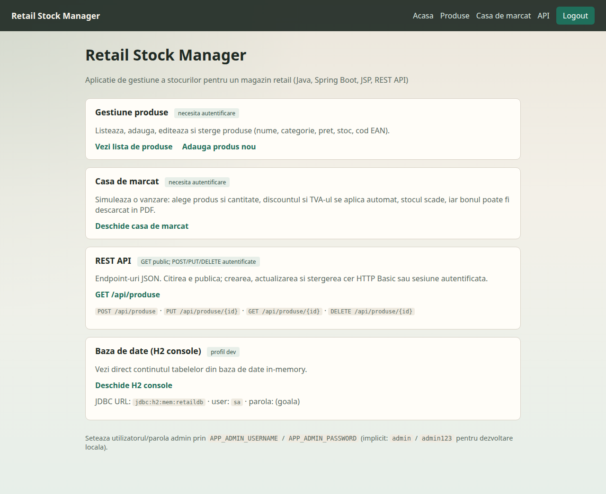
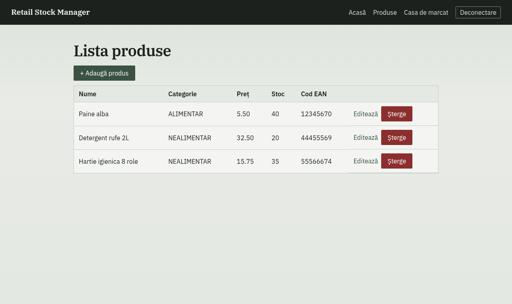
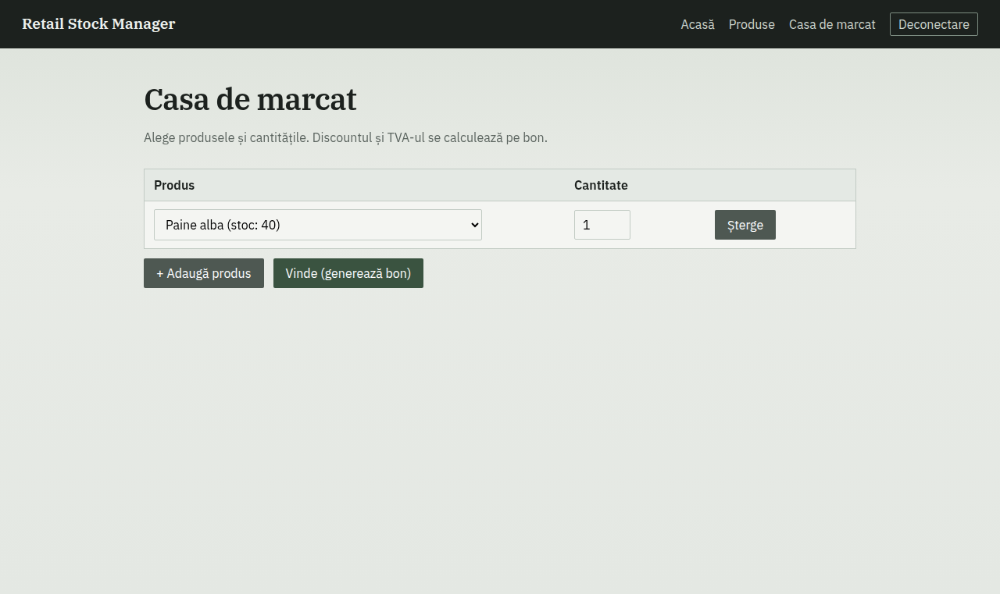

# Retail Stock Manager

I ported the desktop [Store Management System (C#/WinForms)](https://github.com/BogdanNVal/c-sharp)
to Java and Spring Boot, then added checkout, category discounts, TVA, and a small admin login.

## Live demo

**[https://retail-stock-manager.onrender.com](https://retail-stock-manager.onrender.com)**

It's on branch `cursor/retail-live-demo-f498`, not `main`. Log in with `admin` / `admin123`.

Render's free plan sleeps when idle. The first hit after that can take 30–60 seconds —
you'll get a short "starting" page, then the shop.

## Screenshots

### Home



### Product list



### Checkout (discount, TVA, PDF receipt)



## What it does

- Add / edit / delete products (name, category, price, stock, EAN) in the browser or over REST
- EAN-8 / EAN-13 check digits
- Checkout with category discounts and 19% TVA on the receipt
- PDF receipt download
- Optimistic locking on products so two checkouts don't stomp each other

### Discount rules

| Category | Rule |
|---|---|
| `ALIMENTAR` | 5% off when quantity ≥ 5 |
| `NEALIMENTAR` | 10% off when quantity ≥ 3 |

TVA is 19% on the discounted total (`AppConfigSingleton.NivelTva`, default STANDARD).

## Run it

Needs JDK 21 and Maven, or Docker. The profile picks the database — you don't edit
`application.properties` to switch.

| Profile | When | Database |
|---|---|---|
| `dev` (default) | `mvn spring-boot:run` | H2 in-memory |
| `docker` | Compose sets `SPRING_PROFILES_ACTIVE=docker` | MySQL |
| `prod` | Render (`SPRING_PROFILES_ACTIVE=prod`) | PostgreSQL |

### Docker (MySQL stays around)

```bash
docker compose up --build
```

App at http://localhost:8080, phpMyAdmin at http://localhost:8081.
`docker compose down` keeps the volume; `docker compose down -v` wipes it.

### Local without Docker

```bash
mvn spring-boot:run
```

H2 is empty again when the process stops. Useful routes:

- `/produse` — catalog (needs login)
- `/casa-de-marcat` — checkout + PDF (needs login)
- `/api/produse` — REST (GET is public; writes need auth)
- `/h2-console` — `jdbc:h2:mem:retaildb`, user `sa`, empty password

Writes to `/api/produse` take HTTP Basic or a logged-in session. CSRF is off for `/api/**`.

```bash
curl -u admin:admin123 -X POST http://localhost:8080/api/produse \
  -H "Content-Type: application/json" \
  -d '{"nume":"Paine","categorie":"ALIMENTAR","pret":5,"cantitateStoc":20,"codEan":"12345670"}'
```

On Windows PowerShell use `curl.exe` — plain `curl` is `Invoke-WebRequest`.

### Tests

```bash
mvn test
```

Same suite runs in GitHub Actions.

## Credentials

Defaults are fine locally. Don't ship them as production secrets.

| Variable | Default |
|---|---|
| `APP_ADMIN_USERNAME` | `admin` |
| `APP_ADMIN_PASSWORD` | `admin123` |
| `MYSQL_ROOT_PASSWORD` | `parola_root` |

## Test data

`test-data/produse-test.json` has 10 products with valid EANs:

```bash
./test-data/incarca-produse-test.sh
```

There's a PowerShell script in the same folder. Both use `APP_ADMIN_USERNAME` / `APP_ADMIN_PASSWORD`.

## Hosting on Render

Use profile `prod` and a real Postgres URL — H2 on a free host vanishes every time the service sleeps.

1. Deploy repo as a Docker service.
2. Set `SPRING_PROFILES_ACTIVE=prod` and paste `DATABASE_URL` in the dashboard (`postgresql://…?sslmode=require`).
3. Leave the health-check path empty. The entrypoint binds `$PORT` before Java starts.

[render.yaml](render.yaml) is a starting point; `DATABASE_URL` stays `sync: false` on purpose.

`mvn clean package` also builds a WAR you can drop into Tomcat if you need that.
